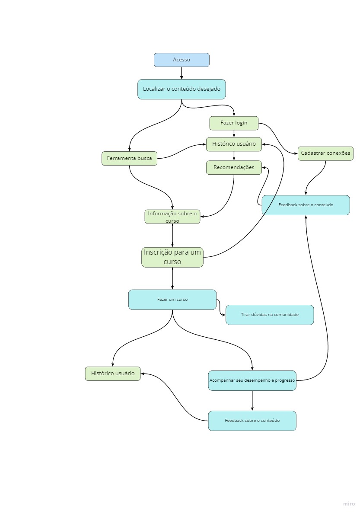
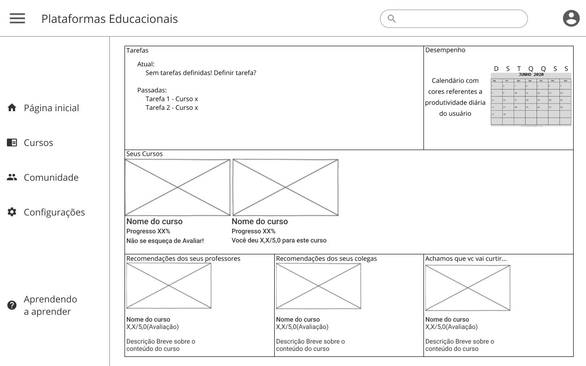
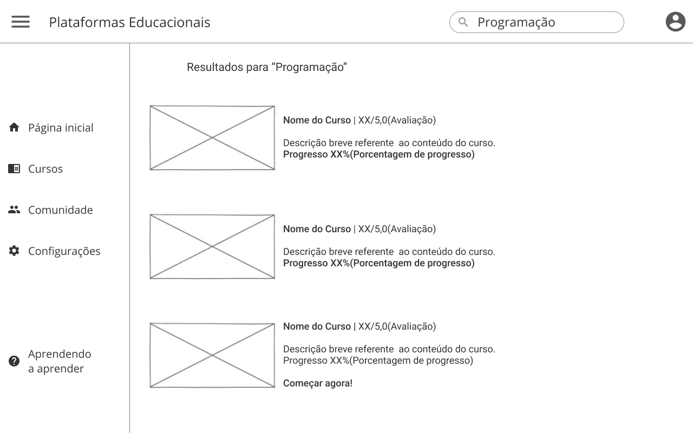
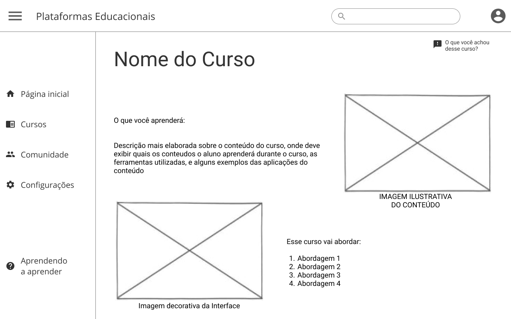
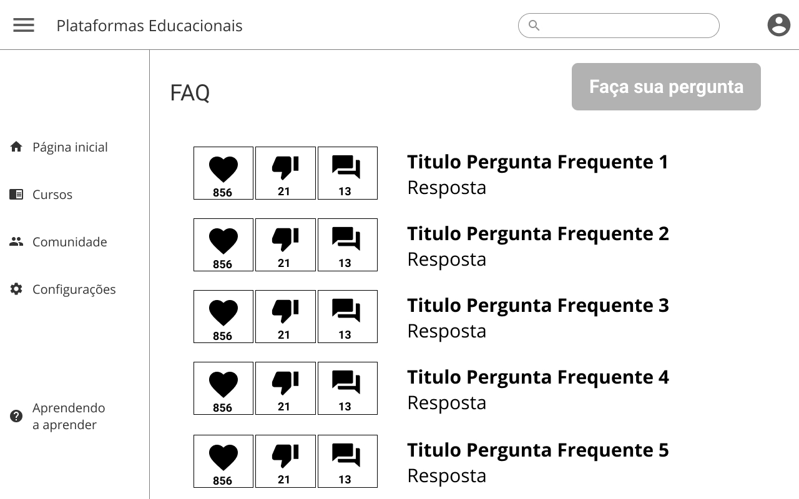
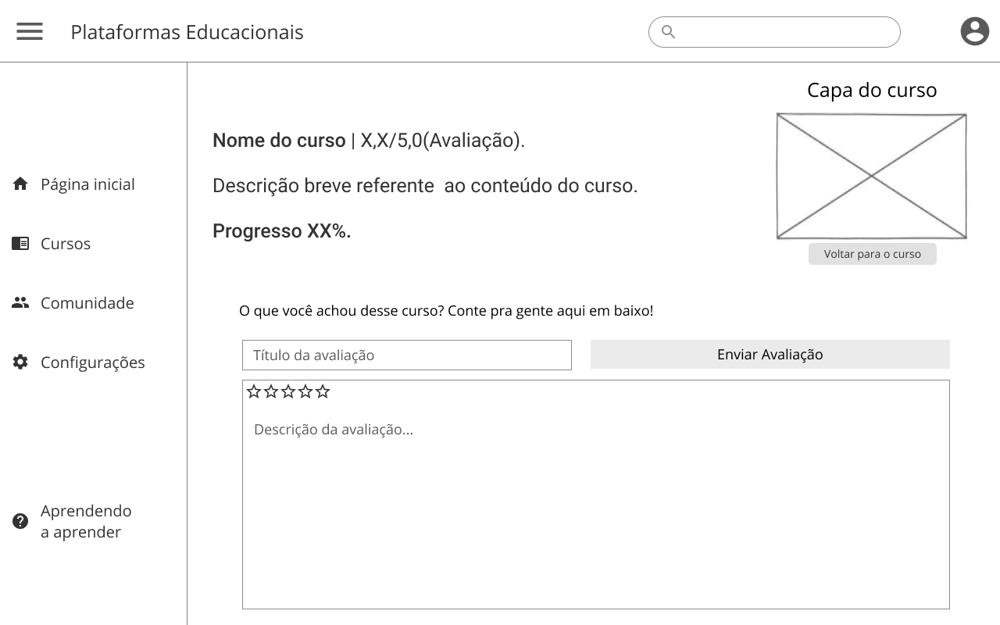
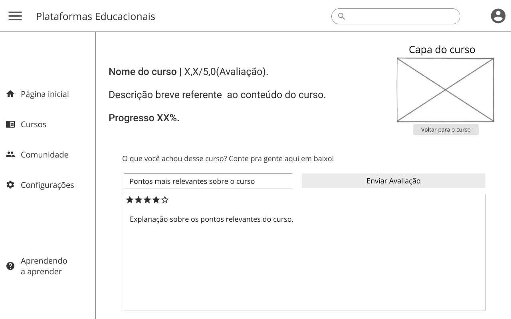
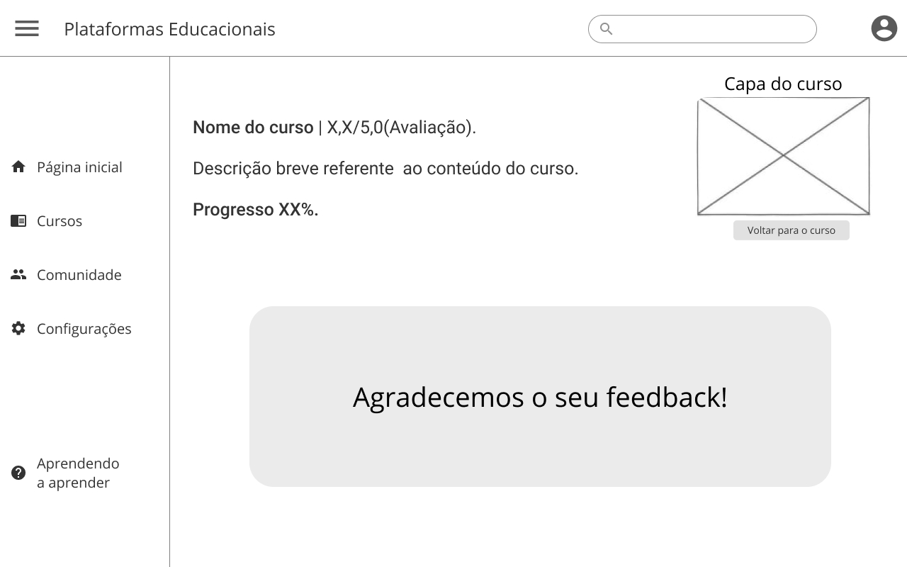

# Projeto de Interface

## User Flow
<<<<<<< HEAD

A imagem a seguir ilustra a o fluxo do usuário em nossa solução. Assim que o usuário entra na plataforma, são mostrados todos os seus cursos cadastrados no formato de cards. Ao clicar no card, o usuário é levado à página do curso.
=======

A imagem a seguir ilustra a o fluxo do usuário em nossa solução. Assim
que o usuário entra na plataforma, ele é apresentado à possibilidade
pesquisar o conteúdo desejado podendo seguir o caminho de fazer um login
ou se cadastrar caso já não tenha uma cadastro. Caso faça o login o usuário
pode então visualizar seu histórico e recomendações baseadas neste, bem
como sugestões baseadas nas recomendações das conexões que pode cadastrar.

Alternativamente, o usuário pode usar a ferramenta de busca, que pode
sugerir resultados baseados em seu histórico se disponível.

As opções convergem no acesso às informações sobre o curso, a partir das
quais o usuário pode fazer a inscrição para o curso ou voltar a procurar.

Selecionado um curso, o usuário pode cadastrá-o entre seus cursos em andamento,
ao que ele passará a constar em seu histórico para recomendações.
Passa também a ter a possibilidade de tirar dúvidas na comunidade, bem como
acompanhar desempenho e progresso. Feito o curso, há a possibilidade
de deixar feedback a seu respeito, que fica no histórico e também retorna
para recomendações gerais do curso na plataforma, bem como para suas conexões.

>>>>>>> 89c220154bf7ae1dde569582e1e7404f71493445

No menu superior, o usuário pode clicar em 'Adicionar curso' para gerenciar seus cursos. Nessa tela, é possível adicionar, alterar ou excluir cursos.

O usuário também pode clicar em 'Adicionar aulas' e gerenciar as aulas de cada curso. Nessa tela, o usuário deve selecionar o curso, e também é possível adicionar, alterar ou excluir aulas.

## Wireframes
#Home Do Site
<<<<<<< HEAD

>
#Pagina de Pesquisa

>
#Pagina do Curso

>
#Pagina Comunidade

>
#Pagina Feedback

>
#Feedback Respondido

=======
> 
>
#Pagina do Curso
> 
> 
> #Pagina das aulas
> 
> 
>>>>>>> 89c220154bf7ae1dde569582e1e7404f71493445
>
>Feedback Enviado
