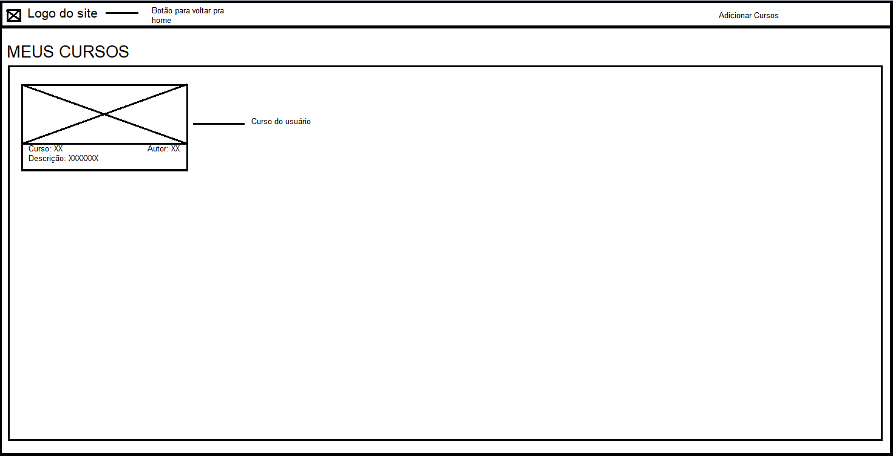
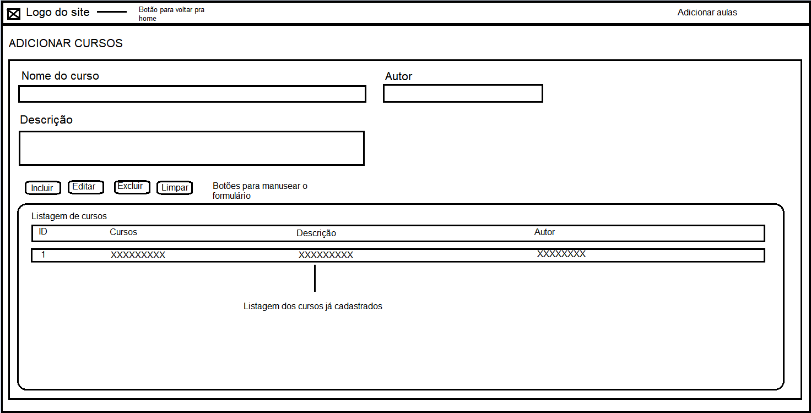
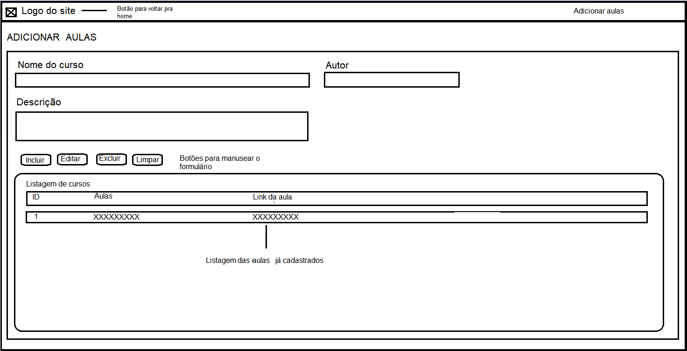

# Projeto de Interface

## User Flow

A imagem a seguir ilustra a o fluxo do usuário em nossa solução. Assim que o usuário entra na plataforma, são mostrados todos os seus cursos cadastrados no formato de cards. Ao clicar no card, o usuário é levado à página do curso.

No menu superior, o usuário pode clicar em 'Adicionar curso' para gerenciar seus cursos. Nessa tela, é possível adicionar, alterar ou excluir cursos.

O usuário também pode clicar em 'Adicionar aulas' e gerenciar as aulas de cada curso. Nessa tela, o usuário deve selecionar o curso, e também é possível adicionar, alterar ou excluir aulas.

## Wireframes

### Home

 
### Pagina do Curso

 
### Pagina das aulas

## Protótipo funcional

Link para acessar o protótipo funcional: https://www.figma.com/proto/VtO72OqlLF1KuUJrr3EVBT/Nome-do-site?node-id=525%3A92&scaling=min-zoom&page-id=525%3A2&starting-point-node-id=525%3A57&show-proto-sidebar=1
