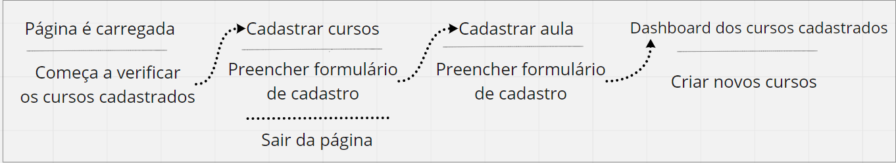
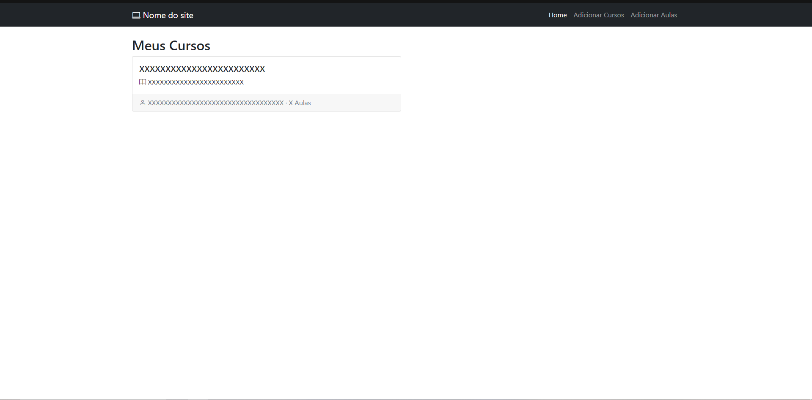
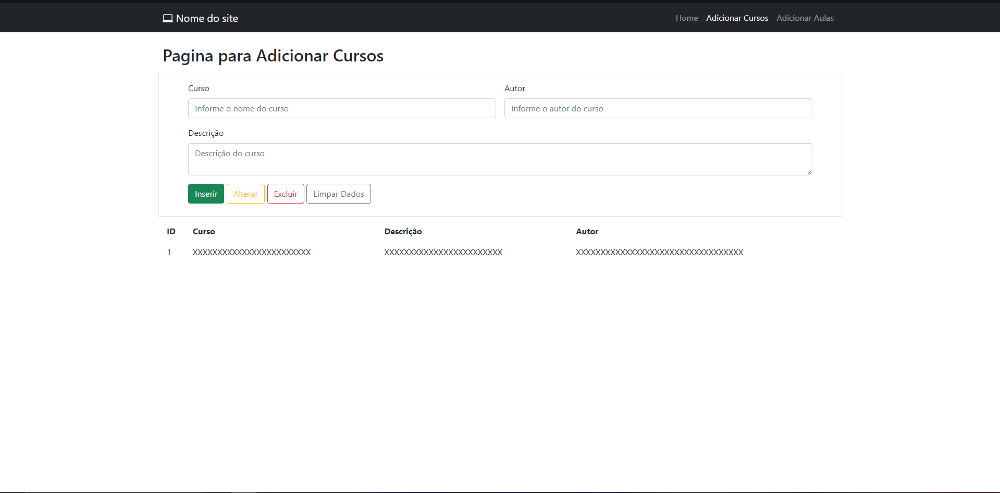
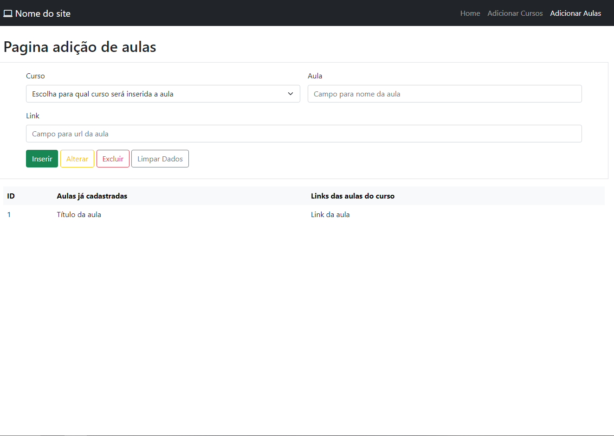

# Projeto de Interface

Pré-requisitos: <a href="2-Especificação.md"> Documentação de Especificação</a>

> Apresente as principais a interface da plataforma. Discuta como ela
> foi elaborada de forma a atender os requisitos funcionais, não
> funcionais e histórias de usuário abordados nas [Especificações do
> Projeto](2-Especificação.md).

## User Flow

A imagem a seguir ilustra a o fluxo do usuário em nossa solução. Assim
que o usuário entra na plataforma, ele é apresentado à possibilidade
pesquisar o conteúdo desejado podendo seguir o caminho de fazer um login
ou se cadastrar caso já não tenha uma cadastro. Caso faça o login o usuário
pode então visualizar seu histórico e recomendações baseadas neste, bem
como sugestões baseadas nas recomendações das conexões que pode cadastrar.

Alternativamente, o usuário pode usar a ferramenta de busca, que pode
sugerir resultados baseados em seu histórico se disponível.

As opções convergem no acesso às informações sobre o curso, a partir das
quais o usuário pode fazer a inscrição para o curso ou voltar a procurar.

Selecionado um curso, o usuário pode cadastrá-o entre seus cursos em andamento,
ao que ele passará a constar em seu histórico para recomendações.
Passa também a ter a possibilidade de tirar dúvidas na comunidade, bem como
acompanhar desempenho e progresso. Feito o curso, há a possibilidade
de deixar feedback a seu respeito, que fica no histórico e também retorna
para recomendações gerais do curso na plataforma, bem como para suas conexões.

> **Links Úteis**:
> - [User Flow: O Quê É e Como Fazer?](https://medium.com/7bits/fluxo-de-usu%C3%A1rio-user-flow-o-que-%C3%A9-como-fazer-79d965872534)
> - [User Flow vs Site Maps](http://designr.com.br/sitemap-e-user-flow-quais-as-diferencas-e-quando-usar-cada-um/)

## Wireframes
#Home Do Site
> 
>
#Pagina do Curso
> 
> 
> #Pagina das aulas
> 
> 
>
> 
> 
