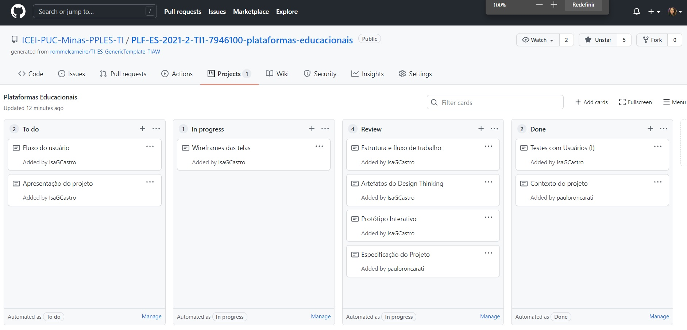

# Gerenciamento de Projeto

> Atualmente a equipe está utilizando a metodologia Scrum, pois torna o projeto
> mais claro e dinâmico e mantém registros de todas as etapas em processamento.
> Dessa forma, os integrantes dos grupos sabem o que precisa ser feito, o que está sendo feito, os projetos em teste
> e a finalização do trabalho.

## Divisão de Papéis

>Scrum Master: Paulo Roncarati De Souza
>Product Owner: Isabela Gontijo de Castro

> Equipe de Desenvolvimento:
-Lucas Santos Rosa
-Mariana Dias Caetano
-Bruno Vieira Cardoso

## Processo

> 
Para organização e distribuição das tarefas do projeto, os integrantes do grupo estam utilizando o **kanban** do **GitHub**: 

-Objetivos: a medida que criamos os cartões das tarefas, indicamos nas colunas as devidas funçoes de cada componente do grupo e verificamos se a pessoa está fazendo, se está em teste ainda ou precisa ser revisado.

-To Do: essa coluna se remete a uma Sprint que inda precisamos fazer.

-In progress: se essa terefa ela foi iniciado por um dos integrantes, ele arrasta o card para essa coluna.

-Review: assim que a pessoa acaba de fazer a terefa, ela é arrastada para essa coluna que se remete à testagem da qualidade do projeto dele.

-Done: Tarefas que são colocadas aqui, já remete que estão preparadas para serem entregues ao usuário e, nesse caso, essa atividade não pode ser mais alterada pelo os integrantes, pois já foi passada no teste de qualidade antes de vir para cá.

## Ferramentas

As ferramentas empregadas no projeto são:

- Editor de código: VS Code
- Ferramentas de comunicação: Microsoft Teams, Google Meet, WhatsApp.
- Ferramentas de diagramação: Figma 

O editor de texto escolhido pela a equipe é de dinâmica funcionalidade e todos já possuem experiência com essa ferramenta. Os meios de comunicação também estão sendoo precisos, pois é de fácil acesso e todos podem entrar nessas plataformas utilizando um email ou número de telefone. Já a ferramenta Figma, foi indicado pelo os professores para ser feito os projetos de interface e, dessa forma, ajudou com a construção de que temos hoje desses projetos do fluxo das telas. 
